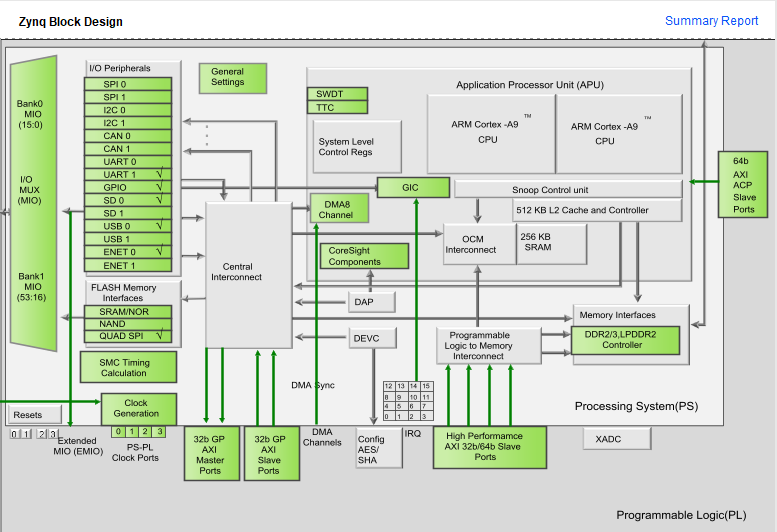

# Documentation

## Réalisation :

Import du fichier picorv32.v (voir [git](https://github.com/YosysHQ/picorv32#files-in-this-repository)).  
Top module : picorv32_axi (The version of the CPU with AXI4-Lite interface)  
=> 

Log de ce que j'ai fait :   
1. Création projet vivado  
2. Ajout du picorv32.v  
3. picorv32_axi en top module  
4. Je le package en IP, je rajoute un param a clk, FREQ HZ (user Param) et je le package  
5. Bloc design, j'importe processing_system7_0 et picorv32_axi_0 mon package.
6. Run Auto Connect par vivado, ajout de axi_mem_intercon et rst_ps7_0_50M
7. Clic droit processing_system7_0, j'ajoute un slave S_AXI_GP0, je connecte mem_axi de mon picorv32_axi_0 au slave du processing system
8. HDL Wrapper du bloc design et synthese puis implementation


## Criticals Warnings et résolutions

### DDR TO CLK DELAY

```tcl
CRITICAL WARNING: [PSU-1] Parameter : PCW_UIPARAM_DDR_DQS_TO_CLK_DELAY_0 has negative value -0.050 . PS DDR interfaces might fail when entering negative DQS skew values. 
CRITICAL WARNING: [PSU-2] Parameter : PCW_UIPARAM_DDR_DQS_TO_CLK_DELAY_1 has negative value -0.044 . PS DDR interfaces might fail when entering negative DQS skew values. 
CRITICAL WARNING: [PSU-3] Parameter : PCW_UIPARAM_DDR_DQS_TO_CLK_DELAY_2 has negative value -0.035 . PS DDR interfaces might fail when entering negative DQS skew values. 
CRITICAL WARNING: [PSU-4] Parameter : PCW_UIPARAM_DDR_DQS_TO_CLK_DELAY_3 has negative value -0.100 . PS DDR interfaces might fail when entering negative DQS skew values. 
CRITICAL WARNING: [PSU-1] Parameter : PCW_UIPARAM_DDR_DQS_TO_CLK_DELAY_0 has negative value -0.050 . PS DDR interfaces might fail when entering negative DQS skew values. 
CRITICAL WARNING: [PSU-2] Parameter : PCW_UIPARAM_DDR_DQS_TO_CLK_DELAY_1 has negative value -0.044 . PS DDR interfaces might fail when entering negative DQS skew values. 
CRITICAL WARNING: [PSU-3] Parameter : PCW_UIPARAM_DDR_DQS_TO_CLK_DELAY_2 has negative value -0.035 . PS DDR interfaces might fail when entering negative DQS skew values. 
CRITICAL WARNING: [PSU-4] Parameter : PCW_UIPARAM_DDR_DQS_TO_CLK_DELAY_3 has negative value -0.100 . PS DDR interfaces might fail when entering negative DQS skew values. 
```

La connection avec les DDR a été faite automatiquement par Vivado. Hors on obtient les criticals warnings ci dessus.

Pour fixer ce problème, j'ai customizé l'IP ZYNQ7 :  
DDR Configuration > Training/Board Details > DQS to clock delay  

J'ai mis DQS0-3 à 0.

Il faudra vérifier que cela ne pose pas de problèmes.

Les DDR sont des mémoires vives qui transfèrent des données rapidement, et les DQS sont des signaux d'horloge qui aident à synchroniser la transmission de ces données.

### Reset Source
```tcl

[BD 41-1347] Reset pin /picorv32_axi_0/resetn (associated clock /picorv32_axi_0/clk) is connected to asynchronous reset source /processing_system7_0/FCLK_RESET0_N.
This may prevent design from meeting timing. Instead it should be connected to reset source /rst_ps7_0_50M/peripheral_aresetn.

[BD 41-1347] Reset pin /axi_mem_intercon/M00_ARESETN (associated clock /axi_mem_intercon/M00_ACLK) is connected to asynchronous reset source /processing_system7_0/FCLK_RESET0_N.
This may prevent design from meeting timing. Instead it should be connected to reset source /rst_ps7_0_50M/peripheral_aresetn.

[BD 41-1347] Reset pin /picorv32_axi_0/resetn (associated clock /picorv32_axi_0/clk) is connected to asynchronous reset source /processing_system7_0/FCLK_RESET0_N.
This may prevent design from meeting timing. Instead it should be connected to reset source /rst_ps7_0_50M/peripheral_aresetn.

[BD 41-1347] Reset pin /axi_mem_intercon/M00_ARESETN (associated clock /axi_mem_intercon/M00_ACLK) is connected to asynchronous reset source /processing_system7_0/FCLK_RESET0_N.
This may prevent design from meeting timing. Instead it should be connected to reset source /rst_ps7_0_50M/peripheral_aresetn.
```
Après que vivado aie rajouté des éléments pour connecter le picorv32 au ZYNQ7 Processing system, les erreurs suivantes apparaissent.

Pour les fixer temporairement, nous allons simplement suivre ce que Vivado nous conseille.

Il faudra vérifier que celà ne pose pas de problème.  
AVANT :
* processing_system7_0/FCLK_RESET0_N -> rst_ps7_0_50M/ext_reset_in  
* processing_system7_0/FCLK_RESET0_N -> picorv32_axi_0/resetn 
* processing_system7_0/FCLK_RESET0_N -> axi_mem_intercon/M00_ARESETN
* rst_ps7_0_50M/peripheral_aresetn -> axi_mem_intercon/ARESETN  
* rst_ps7_0_50M/peripheral_aresetn -> axi_mem_intercon/S00_ARESETN  


APRES :  
* processing_system7_0/FCLK_RESET0_N -> rst_ps7_0_50M/ext_reset_in  
* rst_ps7_0_50M/peripheral_aresetn -> picorv32_axi_0/resetn  
* rst_ps7_0_50M/peripheral_aresetn -> axi_mem_intercon/ARESETN  
* rst_ps7_0_50M/peripheral_aresetn -> axi_mem_intercon/S00_ARESETN  
* rst_ps7_0_50M/peripheral_aresetn -> axi_mem_intercon/M00_ARESETN  

### PCPI

```tcl
 [BD 41-759] The input pins (listed below) are either not connected or do not have a source port, and they don't have a tie-off specified. These pins are tied-off to all 0's to avoid error in Implementation flow.
Please check your design and connect them as needed: 
/picorv32_axi_0/pcpi_wr
/picorv32_axi_0/pcpi_rd
/picorv32_axi_0/pcpi_wait
/picorv32_axi_0/pcpi_ready
/picorv32_axi_0/irq
```

L'interface du coprocesseur (Co-Processor Interface ou CPI) est généralement utilisée dans le contexte des processeurs pour permettre la connexion et la communication avec des coprocesseurs ou des extensions matérielles qui peuvent fournir des fonctionnalités supplémentaires ou spécialisées. Cela permet d'ajouter des capacités personnalisées ou optimisées matériellement au processeur de base.

L'interface du Coprocesseur Pico (PCPI) peut être utilisée pour mettre en œuvre des instructions sans branchement dans des cœurs externes :


    output        pcpi_valid
    output [31:0] pcpi_insn
    output [31:0] pcpi_rs1
    output [31:0] pcpi_rs2
    input         pcpi_wr
    input  [31:0] pcpi_rd
    input         pcpi_wait
    input         pcpi_ready

    output pcpi_valid: Lorsqu'une instruction non prise en charge est rencontrée et que la fonctionnalité PCPI est activée (voir ENABLE_PCPI ci-dessus), pcpi_valid est activé. L'instruction elle-même est sortie sur pcpi_insn, les champs rs1 et rs2 sont décodés et les valeurs dans ces registres sont sorties sur pcpi_rs1 et pcpi_rs2.

    input pcpi_wr: Indique si l'écriture est autorisée.

    input [31:0] pcpi_rd: Indique le registre de destination pour le résultat de l'instruction.

    input pcpi_wait: Indique que le cœur externe PCPI a besoin de plus de temps pour exécuter l'instruction.

    input pcpi_ready: Indiqué par le cœur externe PCPI lorsqu'il a terminé l'exécution de l'instruction.

Un cœur externe PCPI peut alors décoder l'instruction, l'exécuter, et activer pcpi_ready lorsque l'exécution de l'instruction est terminée. En option, une valeur de résultat peut être écrite sur pcpi_rd et pcpi_wr est activé. Le cœur PicoRV32 décodera alors le champ rd de l'instruction et écrira la valeur de pcpi_rd dans le registre correspondant.

Si aucun cœur externe PCPI n'accepte l'instruction dans les 16 cycles d'horloge, une exception d'instruction illégale est déclenchée, et le gestionnaire d'interruption respectif est appelé. Un cœur PCPI qui a besoin de plus que quelques cycles pour exécuter une instruction devrait activer pcpi_wait dès que l'instruction a été décodée avec succès et le maintenir activé jusqu'à ce qu'il active pcpi_ready. Cela empêchera le cœur PicoRV32 de générer une exception d'instruction illégale.


Les PCPI du picoRV32 sont une fonctionnalité utiliser pour mesurer et de surveiller les performances d'un processeur. 

Nous en aurons besoin à la fin si on veux comparer les performances de notre coeur avec un autre coeur risc-V.
Donc on peut désactiver les ports PCPI, ils ne seront pas utiles dans un premier temps à l'implémentationdu picoRV32.

On peut également les utiliser pour nos test de validation.Pour tester différents scénarios ou pour faire du débug.

## Implémentation résultats

### Implementation 1 du 13/01

```
1. Slice Logic
--------------

+----------------------------+------+-------+------------+-----------+-------+
|          Site Type         | Used | Fixed | Prohibited | Available | Util% |
+----------------------------+------+-------+------------+-----------+-------+
| Slice LUTs                 |  927 |     0 |          0 |     53200 |  1.74 |
|   LUT as Logic             |  882 |     0 |          0 |     53200 |  1.66 |
|   LUT as Memory            |   45 |     0 |          0 |     17400 |  0.26 |
|     LUT as Distributed RAM |   44 |     0 |            |           |       |
|     LUT as Shift Register  |    1 |     0 |            |           |       |
| Slice Registers            |  612 |     0 |          0 |    106400 |  0.58 |
|   Register as Flip Flop    |  612 |     0 |          0 |    106400 |  0.58 |
|   Register as Latch        |    0 |     0 |          0 |    106400 |  0.00 |
| F7 Muxes                   |    0 |     0 |          0 |     26600 |  0.00 |
| F8 Muxes                   |    0 |     0 |          0 |     13300 |  0.00 |
+----------------------------+------+-------+------------+-----------+-------+
1.1 Summary of Registers by Type
--------------------------------

+-------+--------------+-------------+--------------+
| Total | Clock Enable | Synchronous | Asynchronous |
+-------+--------------+-------------+--------------+
| 0     |            _ |           - |            - |
| 0     |            _ |           - |          Set |
| 0     |            _ |           - |        Reset |
| 0     |            _ |         Set |            - |
| 0     |            _ |       Reset |            - |
| 0     |          Yes |           - |            - |
| 0     |          Yes |           - |          Set |
| 0     |          Yes |           - |        Reset |
| 15    |          Yes |         Set |            - |
| 597   |          Yes |       Reset |            - |
+-------+--------------+-------------+--------------+

3. Memory
---------

+----------------+------+-------+------------+-----------+-------+
|    Site Type   | Used | Fixed | Prohibited | Available | Util% |
+----------------+------+-------+------------+-----------+-------+
| Block RAM Tile |    0 |     0 |          0 |       140 |  0.00 |
|   RAMB36/FIFO* |    0 |     0 |          0 |       140 |  0.00 |
|   RAMB18       |    0 |     0 |          0 |       280 |  0.00 |
+----------------+------+-------+------------+-----------+-------+
5. IO and GT Specific
---------------------

+-----------------------------+------+-------+------------+-----------+--------+
|          Site Type          | Used | Fixed | Prohibited | Available |  Util% |
+-----------------------------+------+-------+------------+-----------+--------+
| Bonded IOB                  |    0 |     0 |          0 |       125 |   0.00 |
| Bonded IPADs                |    0 |     0 |          0 |         2 |   0.00 |
| Bonded IOPADs               |  130 |   130 |          0 |       130 | 100.00 |
| PHY_CONTROL                 |    0 |     0 |          0 |         4 |   0.00 |
| PHASER_REF                  |    0 |     0 |          0 |         4 |   0.00 |
| OUT_FIFO                    |    0 |     0 |          0 |        16 |   0.00 |
| IN_FIFO                     |    0 |     0 |          0 |        16 |   0.00 |
| IDELAYCTRL                  |    0 |     0 |          0 |         4 |   0.00 |
| IBUFDS                      |    0 |     0 |          0 |       121 |   0.00 |
| PHASER_OUT/PHASER_OUT_PHY   |    0 |     0 |          0 |        16 |   0.00 |
| PHASER_IN/PHASER_IN_PHY     |    0 |     0 |          0 |        16 |   0.00 |
| IDELAYE2/IDELAYE2_FINEDELAY |    0 |     0 |          0 |       200 |   0.00 |
| ILOGIC                      |    0 |     0 |          0 |       125 |   0.00 |
| OLOGIC                      |    0 |     0 |          0 |       125 |   0.00 |
+-----------------------------+------+-------+------------+-----------+--------+
```

Validation : Le picorv32 convient amplement en taille a notre carte, comme prévu


## TO DO : 
* Définir axi  master / slave : expliquer ce que c'est axi, expliquer ahb du coeur, regarder ça plus en détail (utiliser cours de M.THIEBOLT + internet)
* Résoudre les criticals warning du bloc design ([PSU-1]  Parameter : PCW_UIPARAM_DDR_DQS_TO_CLK_DELAY_0 has negative value -0.050 . PS DDR interfaces might fail when entering negative DQS skew values. 
)
* Expliquer pcpi, (Pico Co-Processor Interface (PCPI)), voir ce que l'on en fait
* Observer en détail l'IP du ZYNQ7. Beaucoup de choses a dire dessus et a apprendre. Faire un document qui explique cela  :  (le cours fournit déja quelques explications)


[PCPI](https://shadowcode.io/picorv32-vivado-ip-integrator-project-part1-hardware/) C'est : 
Pico Co-Processor Interface


https://xilinx.github.io/Embedded-Design-Tutorials/docs/2021.2/build/html/docs/Introduction/Zynq7000-EDT/2-using-zynq.html

https://shadowcode.io/picorv32-vivado-ip-integrator-project-part1-hardware/

